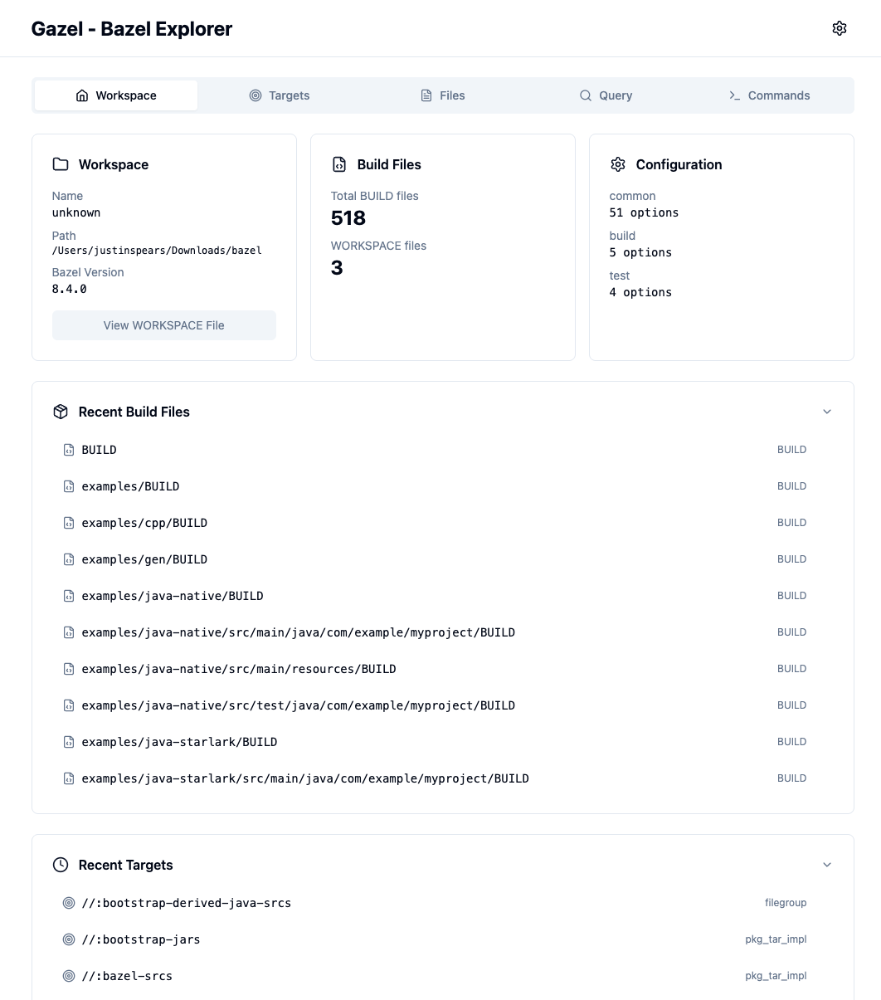

# Gazel

**A modern web-based UI for exploring and understanding Bazel workspaces**


## What is Gazel?

Gazel is a powerful visualization and exploration tool for Bazel build systems. It provides an intuitive web interface to:

- 🔍 **Browse and search** Bazel targets across your entire workspace
- 📄 **View BUILD files** with syntax highlighting and interactive navigation
- 🎯 **Understand target dependencies** and see what files targets produce
- 🚀 **Execute Bazel commands** with real-time output streaming
- 📊 **Run complex queries** using Bazel query language or simple text search

Whether you're new to Bazel or an experienced developer, Gazel makes it easy to understand and navigate complex build configurations.

## Screenshot



## Demo Video

Watch Gazel in action: [View Demo](docs/gazel-bazel.mov)

## Quick Start

### Prerequisites

- **Node.js** >= 18.0.0
- **npm** >= 9.0.0
- **Bazel** (any recent version)

### Quick Commands

```bash
# Development mode with hot reload
bazel run //app:dev

# Production mode
bazel run //app:run
```

Both commands will:
- ✅ Install all dependencies automatically
- ✅ Configure the workspace automatically
- ✅ Open your browser automatically
- ✅ Start both server and client

### Installation

```bash
# Clone the repository
git clone https://github.com/jspears/gazel
cd gazel
```

#### Bazel Run
Well you need bazel anyways so we will just do it with bazel.
```bash
# Just run! Bazel automatically handles all dependencies
bazel run //app:dev
```


**That's it!** Open http://localhost:5173 in your browser.

When you first open Gazel:
- 🔍 It will automatically scan for Bazel workspaces
- 📁 You can select from discovered workspaces or enter a custom path
- 💾 Your selection is saved for future sessions
- 🔄 You can switch workspaces anytime by clicking the path in the Workspace tab

### Optional: Using the Setup Script

For automatic workspace detection during initial setup:

```bash
# Run the interactive setup script (optional)
./setup.sh
```

The setup script will:
- ✅ Check system requirements
- 🔍 Find your Bazel workspace
- 📦 Install dependencies (if not already installed)

Note: The setup script is optional. Gazel can now configure workspaces through its UI.

## Running Gazel

### Development Mode

```bash
npm run dev
```

Opens:
- 🌐 **Frontend**: http://localhost:5173
- 🔧 **API**: http://localhost:3001

### Development with Bazel (Alternative)

You can also use pure Bazel commands to run the application.

#### 🎯 Key Benefits of Using Bazel

**Automatic Dependency Management:**
- ✅ **No manual `pnpm install` needed** - Bazel handles everything!
- ✅ Dependencies are installed automatically from `pnpm-lock.yaml`
- ✅ Bazel caches dependencies for fast subsequent builds
- ✅ The `//:node_modules` target ensures all packages are available
- ✅ Clean, reproducible builds every time

**Automatic Workspace Configuration:**
- ✅ **Client automatically sets the workspace** on startup
- ✅ When running via `bazel run`, the workspace is detected and configured
- ✅ No manual workspace selection needed for Bazel users

**Run both server and client together (recommended):**
```bash
bazel run //app:dev
```
This starts both the backend server (port 3002) and frontend dev server (port 5173) in a single terminal with all dependencies automatically installed, workspace automatically configured, and **opens your browser automatically**.

**Or run them separately:**
```bash
# Terminal 1 - Backend server
bazel run //app:server_dev

# Terminal 2 - Frontend dev server
bazel run //client:dev
```

### Production Mode

```bash
# Build the application
npm run build

# Start the production server
npm start
```

Visit http://localhost:3001

### Production with Bazel (Alternative)

**Run production mode (builds and serves the application):**
```bash
bazel run //app:run
```

This command:
- ✅ Builds the optimized client bundle
- ✅ Starts the production server on port 3002
- ✅ Serves the built client files directly from the server
- ✅ Automatically configures the workspace on client connection
- ✅ **Opens your browser automatically** at http://localhost:3002

The production server serves both the API and the static client files, providing a complete production-ready deployment.

**Or build and run separately:**
```bash
# Build the client
bazel build //client:build

# Build the server
bazel build //server:server_ts

# Run production server
bazel run //app:prod_server

# Preview production build
bazel run //client:preview
```

### Configuration

Gazel manages workspace configuration through the browser:

**Workspace Management**
- Workspace selection is stored in browser Local Storage
- The server keeps the current workspace in memory only
- No workspace configuration is persisted to disk
- Workspace persists across browser sessions
- Switch workspaces easily via the UI

**Optional Server Configuration** (`.env` file)
```env
# PORT=3001  # Optional: change the server port
# BAZEL_EXECUTABLE=/usr/local/bin/bazel  # Optional: custom bazel path
```

To switch workspaces:
- Click on the workspace path in the Workspace tab, or
- Clear browser local storage to reset selection

## What Can You Do With Gazel?

### 🎯 Explore Targets
- **Browse** all targets in your workspace with a clean, searchable interface
- **Smart search** - Use Bazel queries or simple text search
- **Filter** by target type (binary, library, test, etc.)
- **Run executables** - Click "Run" button for any executable target with real-time output streaming
- **See outputs** - Understand what files each target produces
- **Navigate** directly to target definitions in BUILD files

### 📄 Browse BUILD Files
- **Syntax highlighting** for Bazel/Starlark code
- **Interactive navigation** - Click targets to see their details
- **Search** within files to find specific rules
- **Jump** between related files and targets

### 🔍 Run Queries
- **Execute** Bazel query expressions with a friendly UI
- **Save** frequently used queries for quick access
- **Export** results for further analysis
- **Fallback** to text search when queries fail

### 🚀 Execute Commands
- **Build** targets with real-time output streaming
- **Run tests** and see results immediately
- **View history** of all executed commands
- **Debug** with exact command reproduction

### 📊 Visualize Dependencies
- **Graph view** of target dependencies
- **Interactive exploration** of the dependency tree
- **Filter** by depth and target type

## Screenshots

*Coming soon - See [EXAMPLE_USAGE.md](EXAMPLE_USAGE.md) for detailed usage examples*

## Project Structure

```
gazel/
├── client/                 # Frontend application (Svelte + Vite)
│   ├── lib/               # Shared components and utilities
│   │   ├── components/    # Svelte components
│   │   ├── stores/        # Svelte stores
│   │   ├── types/         # TypeScript types
│   │   └── utils/         # Utility functions
│   ├── routes/            # Application routes
│   ├── index.html         # HTML entry point
│   ├── main.ts           # Application entry
│   ├── app.css           # Global styles
│   ├── vite.config.ts    # Vite configuration
│   ├── svelte.config.js  # Svelte configuration
│   ├── tailwind.config.js # Tailwind configuration
│   ├── postcss.config.js # PostCSS configuration
│   └── BUILD.bazel      # Bazel build configuration
├── server/               # Backend server (Express + TypeScript)
│   ├── index.ts         # Server entry point
│   ├── routes/          # API routes
│   └── BUILD.bazel     # Bazel build configuration
├── app/                 # Application launchers
│   └── BUILD.bazel     # Bazel targets for running apps
├── MODULE.bazel        # Bazel module configuration (bzlmod)
├── BUILD.bazel         # Root build configuration
├── package.json        # npm dependencies
├── pnpm-lock.yaml     # pnpm lock file
├── tsconfig.json      # TypeScript configuration
└── tsconfig.server.json # Server TypeScript configuration
```

## Documentation

- 📖 **[Usage Examples](EXAMPLE_USAGE.md)** - Step-by-step guide with examples
- 🔧 **[Technical Details](TECHNICAL_DETAILS.md)** - Architecture, API, and development notes
- 🚀 **[Contributing](CONTRIBUTING.md)** - How to contribute to the project
- 📊 **[ELK Graph Implementation](ELK_GRAPH_IMPLEMENTATION.md)** - Details on the graph visualization

## Troubleshooting

### Common Issues

**Bazel not found**
- Make sure Bazel is installed and in your PATH
- Test with: `bazel version`

**Port already in use**
- Change the port in `.env`: `PORT=3002`
- Or use a different port: `PORT=3002 npm run dev`

**Workspace not detected**
- Ensure your workspace has a `MODULE.bazel` file
- Run `./setup.sh` to reconfigure

**Permission denied**
- The server needs read access to your Bazel workspace
- Check file permissions: `ls -la /path/to/workspace`

### Getting Help

- 📝 Check the [documentation](TECHNICAL_DETAILS.md)
- 🐛 [Report issues](https://github.com/jspears/gazel/issues)
- 💬 [Start a discussion](https://github.com/jspears/gazel/discussions)

## Contributing

We welcome contributions! See [CONTRIBUTING.md](CONTRIBUTING.md) for guidelines.

## License

MIT License - see [LICENSE](LICENSE) for details

## Acknowledgments

Built with:
- [Svelte](https://svelte.dev/) - Cybernetically enhanced web apps
- [Bazel](https://bazel.build/) - Fast, reliable build system
- [Tailwind CSS](https://tailwindcss.com/) - Utility-first CSS framework
- [highlight.js](https://highlightjs.org/) - Syntax highlighting

---

**Made with ❤️ for the Bazel community**
